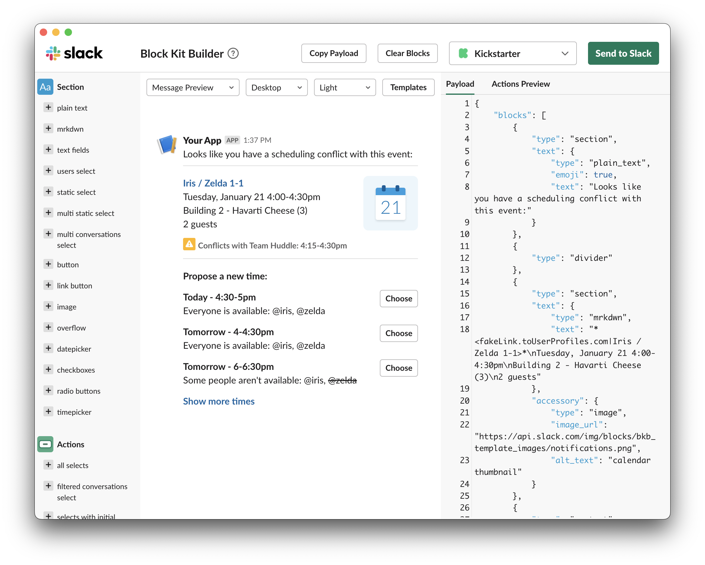

# Slack Block Kit Builder

Slack's Block Kit Builder packaged as an Electron app.



## Install

Unfortunately, I haven't had the time to sign & distribute this app yet (see TODO section), so you'll need to clone and build the application yourself.

Clone the repo with git:

```bash
git clone https://github.com/amancevice/block-kit
```

Build and install the app on macOS with make:

```bash
make install
```

## TODO

- [x] Persist Light/Dark theme on restart
- [ ] Sign & distribute app with Homebrew
